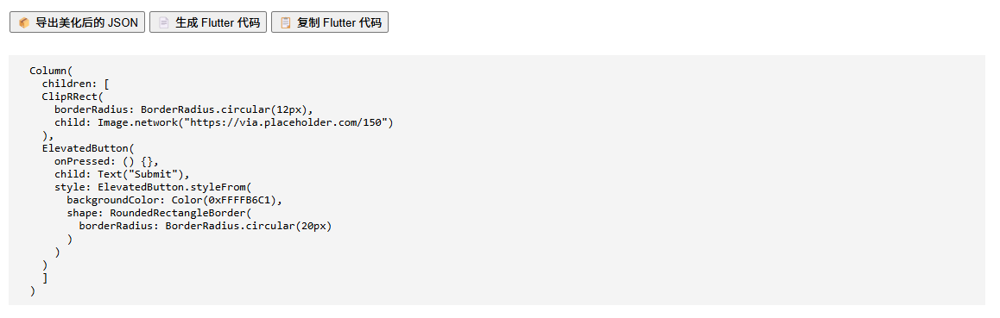

# UI EZ 🎨  
让界面设计变得 EZ（Easy）！

✨ 一个为无代码/低代码开发者打造的“一键 UI 美化工具”，帮助你快速美化 Flutter / React 项目界面结构，像 Canva 一样轻松预览 + 应用样式。

访问地址 👉 [https://annaz10003.github.io/UI_EZ](https://annaz10003.github.io/UI_EZ)

---

## 🛠 功能特色

- ✅ 上传 JSON 格式的 UI 页面结构
- ✅ 自动识别组件类型（Button / TextField / Card / Image / Divider）
- ✅ 左右并列展示原始样式 vs 美化后样式
- ✅ 支持多套美化风格模板（现代蓝白 / 柔和紫粉）
- ✅ 实时预览美化按钮与图片样式
- ✅ 一键导出美化后的结构 JSON 文件
- ✅ 一键生成 Flutter 组件代码片段
- ✅ 📋 一键复制 Flutter 代码！

---

## 🖼 项目预览

> 快速识别 + 美化结构 + 一键复制代码 👇

| 上传结构 | 美化效果 | 代码输出 |
|----------|----------|----------|
|  |  |  |

> *如果你还没有截图文件，我可以帮你生成 placeholder 示例图放进 `screenshots/` 文件夹中～*

---

## 💡 项目背景

UI EZ 项目由 Ana 发起，起源于她在开发 Flutter/无代码工具时的一个需求：

> “我想要一个像 Canva 一样的 UI 工具，能一键美化 JSON 结构生成的界面，别再手动调颜色/圆角/边框啦！”

Ana 希望 UI EZ 成为无代码/低代码开发者的 UI 助手 —— 结构你来写，美化我来帮！

---

## 🔮 下一步计划（欢迎参与！）

- [ ] 支持生成 React 组件代码
- [ ] 增加更多风格模板（暗色风、杂志风、拟物风…）
- [ ] 可自定义控件风格细节（字体、阴影、边框等）
- [ ] 支持“在线编辑 JSON” + 实时预览

---

## 🤝 联系作者 / 加入协作

如果你觉得这个项目有趣，欢迎 star、fork 或加入开发！

📮 作者邮箱：**Anaz723@outlook.com**  
🐱 GitHub 地址：[https://github.com/annaz10003/UI_EZ](https://github.com/annaz10003/UI_EZ)

---

> Made with ❤️ by Ana
